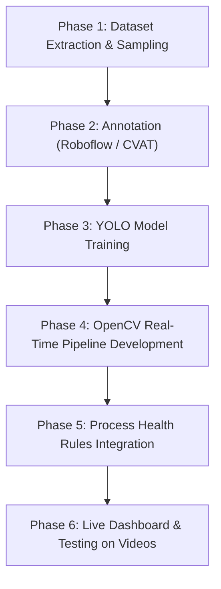

# Vision-Based Metal Chip Classification & Machining Process Health Monitoring
## Comprehensive Technical Context & Knowledge Reference

---

## 1. Executive Summary & Project Goal

In metal turning operations (lathe machining), the shape, curl, twist, thickness, and color of the metal shavings (known as **chips**) provide direct, real-time indicators of machining quality, tool wear, cutting temperature, and operational safety.

The objective of this project is to develop a **real-time computer vision and deep learning system** that:
1. **Detects and tracks metal chips** emerging from the tool-workpiece interface during turning operations.
2. **Analyzes chip morphology** (shape, curliness, turns/twists, thickness, and structural continuity).
3. **Measures chip thermal discoloration** (surface oxidation colors indicating temperature and friction).
4. **Classifies process health** into actionable states (**OPTIMAL**, **WARNING**, **CRITICAL/DANGEROUS**).
5. **Renders real-time visual overlays** (bounding boxes, morphology tags, confidence scores, and health alerts) on live or recorded video streams.

---

## 2. Machining Principles & ISO Chip Standards

### 2.1 Turning Operation Parameters
During turning, a single-point cutting tool removes material from a rotating cylindrical workpiece. The key operational parameters are:
* **Spindle Speed ($N$, in RPM)**: Rotational speed of the workpiece.
* **Cutting Speed ($v_c$, in m/min)**: $v_c = \frac{\pi \cdot D \cdot N}{1000}$ where $D$ is workpiece diameter in mm.
* **Depth of Cut ($a_p$, in mm)**: Thickness of metal layer removed per pass (in our dataset: $0.5\text{ mm}$, $0.6\text{ mm}$, $0.75\text{ mm}$).
* **Feed Rate ($f$, in mm/rev)**: Linear movement of tool per spindle revolution.

### 2.2 Mechanics of Chip Formation
Material shear occurs in the primary shear zone. High friction between the chip and the tool face (secondary shear zone) generates intense heat. The shape and behavior of the resulting chip depend on material ductility, tool geometry (rake angle, chip breaker groove), depth of cut, and speed:
* **Continuous Chips**: Formed when cutting ductile materials (e.g., Aluminium, Copper) at high speeds. Can tangle around tool/chuck if chip breaker is ineffective.
* **Discontinuous / Segmented Chips**: Formed when cutting brittle materials or ductile materials at low speeds / high feed rates. Easily cleared.

---

### 2.3 ISO 3685 Standard Chip Classification

The ISO 3685 standard categorizes chip morphology into 8 primary forms, which map directly to machining process health:

| ISO Form | Description | Visual Appearance | Process Health Status | Operational Impact |
| :--- | :--- | :--- | :--- | :--- |
| **Form 1: Ribbon Chips** | Long, continuous, straight or slightly curved strands | Extended straight metallic strip | 🔴 **UNFAVORABLE / WARNING** | Tangles around tool post; dangerous to operator; damages surface finish. |
| **Form 2: Tubular Chips** | Long continuous helical tube | Long tight spring-like coil | 🔴 **UNFAVORABLE / WARNING** | Poor chip evacuation; potential tool holder jamming. |
| **Form 3: Spiral Chips** | Flat or conical spiral coils | Flat clock-spring spiral | 🟡 **ACCEPTABLE / FAIR** | Moderate evacuation safety; acceptable for light cuts. |
| **Form 4: Washer Helical** | Short helical turns resembling lock washers | Short 1–3 turn coils | 🟢 **FAVORABLE / OPTIMAL** | Excellent chip breaking; safe automatic disposal. |
| **Form 5: Connected Arc** | Arc fragments connected by thin web | C-shaped connected chain | 🟢 **FAVORABLE / OPTIMAL** | Good chip breaker operation; stable cut. |
| **Form 6: Loose Arc (C-Shaped)** | Individual comma or C-shaped fragments | Distinct C-shapes | 🟢 **FAVORABLE / IDEAL** | **Ideal machining state**. Low cutting force, easy removal. |
| **Form 7: Elemental Chips** | Completely broken tiny fragments | Small irregular flakes/granules | 🟢 **FAVORABLE / GOOD** | Easy removal; typical of cast iron or high-feed cuts. |
| **Form 8: Needle Chips** | Extremely fine, sharp needle-like splinters | Sharp tiny slivers | 🟡 **WARNING** | Hazardous splinters; potential tool edge micro-chipping. |

---

### 2.4 Thermal Discoloration & Heat Physics

As cutting temperature increases due to tool wear, lack of coolant, or excessive speed, the surface of steel/metal chips oxidizes upon contact with air, creating distinct temper colors:

$$\text{Temperature Increase} \implies \text{Thicker Oxide Layer} \implies \text{Light Wave Interference (Color Shift)}$$

#### Chip Color Heat Scale (Steel):
* **Bright Natural Silver ($\approx < 200^\circ\text{C}$)**: Normal cutting conditions; adequate cooling.
* **Light Straw / Golden Yellow ($\approx 220^\circ\text{C} - 240^\circ\text{C}$)**: Moderate temperature; acceptable light cutting.
* **Brown / Purple ($\approx 260^\circ\text{C} - 280^\circ\text{C}$)**: High thermal friction; tool wear starting.
* **Dark Blue / Violet ($\approx 290^\circ\text{C} - 320^\circ\text{C}$)**: ⚠️ **Extreme thermal friction**; high tool wear / thermal breakdown.
* **Grey / Dull Black ($> 400^\circ\text{C}$)**: Severe overheating; severe insert failure / breakdown.

---

## 3. Computer Vision & Feature Extraction Concepts

### 3.1 Color Space Conversions (RGB vs. HSV vs. LAB)
Standard RGB (Red, Green, Blue) is sensitive to changes in lighting intensity and highlights. To reliably measure chip color and heat discoloration under workshop lighting:

* **HSV (Hue, Saturation, Value)**:
  * **Hue ($H$, $0^\circ-360^\circ$ or $0-179$ in OpenCV)**: Represents the pure color wavelength (e.g., Blue: 100–130, Yellow/Gold: 15–35). Independent of brightness!
  * **Saturation ($S$, $0-255$)**: Represents color intensity/purity.
  * **Value ($V$, $0-255$)**: Represents brightness.

```python
# Converting frame to HSV for thermal color extraction
hsv_frame = cv2.cvtColor(chip_crop, cv2.COLOR_BGR2HSV)
# Masking Blue/Purple oxidization range
blue_mask = cv2.inRange(hsv_frame, (100, 50, 50), (130, 255, 255))
heat_ratio = np.sum(blue_mask > 0) / (chip_crop.shape[0] * chip_crop.shape[1])
```

### 3.2 Region of Interest (ROI) & Masking
To prevent background clutter (such as accumulated old chips sitting on the lathe bed) from interfering with live detection:
* **Spatial ROI**: Crop or focus the detection zone to a bounding rectangle around the active tool insert tip:
  $$\text{ROI} = [(X_{\text{tool}} - \Delta x, Y_{\text{tool}} - \Delta y), (X_{\text{tool}} + \Delta x, Y_{\text{tool}} + \Delta y)]$$
* **Motion Masking / Frame Differencing**: Subtract consecutive frames to highlight *moving* emerging chips vs. static background chips.

### 3.3 Geometric Morphology & Contour Features
For measuring turns, twists, thickness, and curliness using OpenCV:
* **Contour Area ($A$) & Perimeter ($P$)**:
  * **Compactness / Circularity ($C$)**: $C = \frac{4\pi \cdot A}{P^2}$. High for C-chips ($\approx 0.6-0.8$), low for long ribbons ($< 0.1$).
  * **Bounding Box Aspect Ratio**: $\text{AR} = \frac{\text{Width}}{\text{Height}}$.
  * **Solidity**: Ratio of contour area to its convex hull area ($A / A_{\text{hull}}$). Measures roughness/twist gaps.
  * **Skeletonization / Thinning**: Reduces chip contour to 1-pixel-wide centerlines to count number of loops/turns and measure true strand length.

---

## 4. Deep Learning Architectures & Pipeline

### 4.1 Single-Stage Object Detection (YOLO)
**YOLO (You Only Look Once)** processes the entire video frame in a single evaluation pass, making it ultra-fast ($\ge 60\text{ FPS}$) for real-time video feeds.

#### YOLO Architecture Breakdown:
1. **Backbone (Feature Extractor)**: ConvNeXt or CSPDarkNet extracts multi-scale visual features from low-level edges to high-level shapes.
2. **Neck (Feature Aggregator)**: PANet / FPN aggregates multi-scale feature maps to detect both tiny chip fragments and large continuous ribbons simultaneously.
3. **Head (Predictor)**: Outputs bounding box coordinates $(x, y, w, h)$, objectness score $P(\text{object})$, and class probability distribution.

```
Input Frame (848x478) ──► YOLO Backbone ──► Feature Pyramid (PANet) ──► Detection Head ──► Bounding Boxes + Classes
```

### 4.2 Two-Stage Health Analysis Pipeline (Recommended for Deep Inspection)

```
                       ┌─────────────────────────────────────────┐
                       │ Stage 1: YOLO Object Detector           │
                       │ (Locates active chip emerging from tool)│
                       └────────────────────┬────────────────────┘
                                            │
                                      Cropped Chip
                                            │
                       ┌────────────────────▼────────────────────┐
                       │ Stage 2: Feature & Morphology Engine    │
                       ├─────────────────────────────────────────┤
                       │  a) HSV Thermal Color Analyzer          │
                       │  b) Contour / Curl Classifier           │
                       │  c) Thickness & Aspect Ratio Estimator  │
                       └────────────────────┬────────────────────┘
                                            │
                                            ▼
                       ┌─────────────────────────────────────────┐
                       │ Process Health Rules & Live Dashboard   │
                       │ (OPTIMAL / WARNING / DANGEROUS ALERT)   │
                       └─────────────────────────────────────────┘
```

---

## 5. Summary of the Experimental Dataset

Your dataset in `Videos - prev` consists of **28 MP4 videos** and **3 reference photos** recorded across 19 planned lathe turning experiments:

* **Video Specifications**: $848 \times 478$ resolution, $60\text{ FPS}$, Full HD source.
* **Total Frame Count**: $> 60,000$ individual image frames.

### Experiment Matrix:

| Material | Depth of Cut ($a_p$) | Spindle Speed ($N$) | Video Identifiers | Expected Chip Morphology |
| :--- | :--- | :--- | :--- | :--- |
| **Aluminium (Al)** | $0.5\text{ mm}, 0.6\text{ mm}, 0.75\text{ mm}$ | $280, 450, 710, 1120\text{ RPM}$ | Videos 1 to 7 | Highly continuous ribbons & tubular coils |
| **Copper (Cu)** | $0.5\text{ mm}, 0.75\text{ mm}$ | $450, 710, 1120\text{ RPM}$ | Videos 8 to 12 | Ductile continuous & spiral coils |
| **Mild Steel** | $0.5\text{ mm}, 0.75\text{ mm}$ | $280, 450, 710, 1120\text{ RPM}$ | Videos 13 to 19 | Segmented, C-shaped, & oxidized colored chips |

---

## 6. End-to-End Project Roadmap



### Phase 1: Dataset Preparation (Automated)
* Write Python script using OpenCV to sample 2–4 frames per second from all 28 videos.
* Filter out empty pre-cutting or post-cutting frames.

### Phase 2: Annotation
* Upload sampled images to an annotation tool (e.g., Roboflow or CVAT).
* Draw bounding boxes around active chips and tag classes:
  * `chip_c_shaped` (Ideal)
  * `chip_spiral` (Acceptable)
  * `chip_ribbon_tangle` (Warning)
  * `chip_burnt_discolored` (High Heat Alert)

### Phase 3: Model Training
* Train YOLOv8 / YOLOv11 nano/small model on GPU.
* Target Metrics: $\text{mAP@50} \ge 90\%$, Inference Latency $\le 15\text{ ms}$.

### Phase 4 & 5: Live Pipeline & Health Logic
* Combine YOLO detector with HSV color analysis and OpenCV shape contour analysis.
* Build logic engine to output real-time process health status: **OPTIMAL**, **WARNING**, **DANGEROUS**.

### Phase 6: GUI & Video Dashboard
* Display real-time annotated video window with color-coded bounding boxes, FPS counter, and process health alerts.

---

## 7. Glossary of Essential Terms

* **Chip (Swarf)**: Metal waste material sliced off by the cutting tool.
* **Chip Breaker**: A groove or obstacle on the cutting insert designed to curl and snap chips into small pieces.
* **YOLO (You Only Look Once)**: A state-of-the-art real-time deep learning object detection algorithm.
* **FPS (Frames Per Second)**: Video playback rate (our videos run at 60 FPS).
* **HSV Color Space**: Hue, Saturation, Value color representation used to isolate colors like blue/yellow regardless of lighting brightness.
* **mAP (Mean Average Precision)**: Standard accuracy metric for object detection AI models.

---

## 8. Academic Literature Review & Publishable Research Novelties

### 8.1 Current State of the Art (What Existing Research Has Done)
Recent literature in smart manufacturing (2022–2025) covers:
1. **Basic YOLO Object Detection**: Applying standard YOLO (v8/v11) to detect or count metal chips as single-class targets.
2. **Offline Post-Machining Inspection**: Taking high-resolution static photos of collected chips after cutting and analyzing RGB/HSV colors to correlate with tool flank wear.
3. **Single-Material Case Studies**: Testing vision pipelines on a single material (e.g. Steel only) under fixed lab conditions.

### 8.2 Critical Research Gaps (Unsolved Problems in Existing Papers)
* ❌ **No Dual-Modality Fusion**: Existing papers analyze *either* spatial object detection *or* offline color oxidation. No paper fuses real-time spatial geometry (ISO 3685 curls/twists) AND real-time thermal oxidation color analysis in a single live 60 FPS pipeline.
* ❌ **Lack of Multi-Material Cross-Domain Validation**: Existing models are trained on one material and fail when applied to others due to differing reflection and chip mechanics.
* ❌ **Susceptibility to Static Lathe Bed Clutter**: Existing models frequently mistake static accumulated chips on the machine tray for active cutting chips.

### 8.3 Proposed Novel Contributions (To Make Your Paper Unique & Publishable)

1. **Novel Contribution 1: Dual-Modality Real-Time Chip Health Engine (Spatial-Spectral Fusion)**
   * Fusing **Spatial Geometry Features** (ISO 3685 curl classification, aspect ratio, solidity) with **Spectral Thermal Oxidization Features** (HSV temper color spectrum: Silver $\rightarrow$ Gold $\rightarrow$ Blue/Purple) into a unified live 60 FPS decision engine.

2. **Novel Contribution 2: Multi-Material Cross-Domain Benchmark (Al vs. Cu vs. Mild Steel)**
   * Evaluating and benchmarking the vision pipeline across three distinct material domains (Aluminium, Copper, Mild Steel) under varying depths of cut ($0.5-0.75\text{ mm}$) and speeds ($280-1120\text{ RPM}$).

3. **Novel Contribution 3: Dynamic Tool-Centric ROI & Clutter Immunity Algorithm**
   * A temporal background-subtraction and tool-tracking ROI mechanism that isolates *active emerging chips* from static chips lying on the lathe bed, achieving high precision in industrial clutter.

4. **Novel Contribution 4: Real-Time Composite Process Health Index (PHI)**
   * Introducing a continuous mathematical index $\text{PHI} \in [0, 100\%]$ quantifying machining process stability, chip breaking efficiency, and thermal risk in real time.

### 8.4 Suggested Research Paper Titles
* *"Real-Time Dual-Modality Vision Monitoring of Turning Process Health via Chip Morphology and Thermal Oxidation Analysis"*
* *"A Multi-Material Computer Vision System for ISO 3685 Chip Classification and Process Instability Detection in Turning Operations"*

